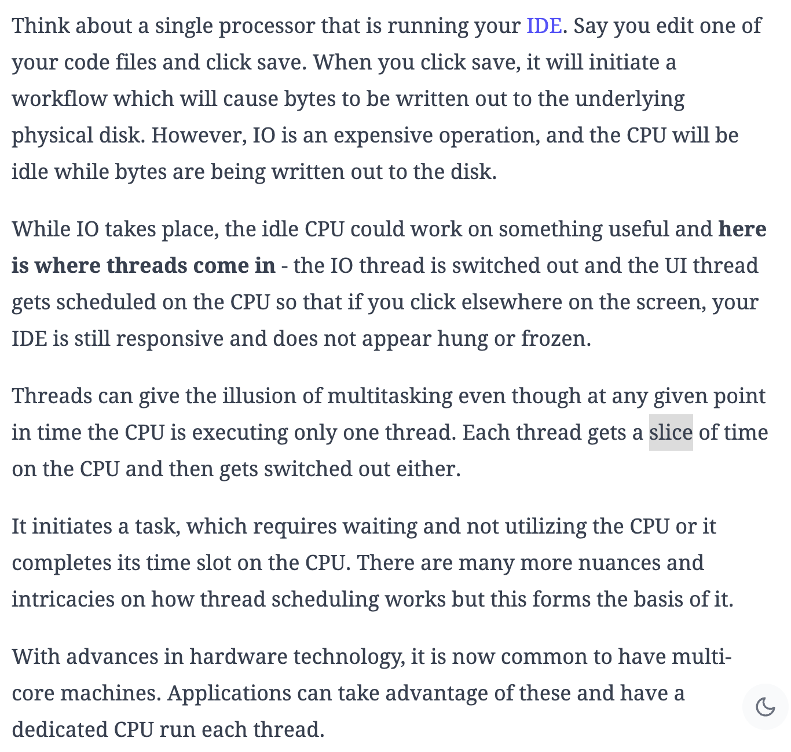

# Concurrency and Multithreading

- **Concurrency** is when the execution of multiple tasks is interleaved, instead of each task being executed sequentially one after another. Broader concept that could be achieved using a single CPU or multiple CPUs.
  - **Parallelism** is when these tasks are actually being executed in parallel. This is when concurrency involves multiple CPUs or CPU cores.
  - **Time-Sharing** achieved using a single CPU through techniques like time-sharing, where the CPU switches between tasks quickly, giving the appearance of simultaneous execution.
- [Link](https://www.educative.io/blog/multithreading-and-concurrency-fundamentals)
- [Stack Overflow Link](https://stackoverflow.com/questions/4844637/what-is-the-difference-between-concurrency-parallelism-and-asynchronous-methods)

## Multithreading 

- Multithreading is a technique that allows for concurrent (simultaneous) execution of 2 or more parts of a program for maximum utilization of a CPU.
  - For example, multithreading allows you to write code in 1 program and listen to music in another.
- Programs are made up of _processes_ and _threads_:
  - A program is an executable file like chrome.exe
  - A process is an executing instance of a program. When you double click on the Google Chrome icon on your computer, you start a process which will run the Google Chrome program.
  - Thread is the smallest executable unit of a process. A process can have multiple threads with 1 main thread. In the example, a single thread could be displaying the current tab you are in, and a different thread could be another tab.

---
#### Example of Multithreading

---

## Why use Multithreading?

- With a **single core** and **multiple threads**, the application has to transition back and fourth to give the illusion of multitasking.
- With **multiple cores**, the application can take advantage of the underlying hardware to run individual threads through a dedicated core, thus making the application more responsive and efficient. Multithreading allows us to take full advantage of the CPU and multiple cores, so there will be no untapped processing power with idle cores.
- Developers should make use of multithreading for these reasons:
    - Higher throughput
    - Responsive applications that give the illusion of multitasking.
    - Efficient utilization of resources. Thread creation is light-weight in comparison to spawning a brand new process and for web servers that use threads, instead of creating a new process when fielding web requests, consume far fewer resources.
- NOTE: More threads doesn't mean a faster application. There are cases where we want to avoid threads, especially when the application performs a lot of sequential operations.

# Basic Concepts of Multithreading

## Programs, Processes and Threads

- **Programs**
    - Operating systems can run multiple programs at the same time.
    - For example, you are reading this article in the browser (a program) but you can also listen to music on your media player (another program).
- **Processes**
    - Used to execute the program.
    - Each process is able to run concurrent subtasks called threads.
- **Threads**
    - Sub-tasks of processes and if synchronized correctly, can give the illusion that the application is performing everything at once.
    - Without threads, you would have to write one program per task, run them as processes and synchronize them through the operating system.

## Concurrency

- Concurrency is the ability of your program to "deal" (not doing) with many things at once and is achieved through multithreading.
- Do not confuse concurrency with parallelism which is about "doing" many things at once.

## Locking

- Locks are a synchronization technique used to **limit access to a resource** in an environment where there are many threads of execution.
- A good example of a lock is a **mutex**

## Mutex

- Mutex implies "mutual exclusion".
- A mutex is used to guard shared data such as a linked-list, an array or any simple primitive type.
- A mutex allows only a single thread to access a resource.

# Issues Involved with Multiple Threads

## Race Conditions

- **Critical Section** is any price of code that has the possibility of being executed concurrently by more than 1 thread of the application and exposes any shared data or resources used by the application for access.
- Race conditions happen when threads run through critical sections without thread synchronization (e.g., using locks).
- The threads "race" through the critical sections to write or read shared resources and depending on the order in which threads finish the "race", the program output changes.
- In a race condition, threads access shared resources or program variables that might be worked on by other threads at the same time *causing the application data to be inconsistent*! BAD!